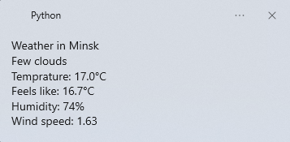

# Weather Script

A simple Python script that shows the current weather in your city using Windows notifications every time you start your PC.

## Features

* Current temperature (°C)
* Feels-like temperature (°C)
* Humidity (%)
* Wind speed (km/h)
* Weather description
* English and Russian language support
* Automatic launch on Windows startup

## Preview



## Requirements

Before installing, make sure you have:

* Python 3.12 or 3.13
* Windows 10/11
* OpenWeatherMap account
* OpenWeatherMap API key

> **Note**
>
> Python **3.14 is currently not supported** because one of the notification dependencies (`winsdk`) is not yet compatible.
> This problem will be solved in future releases


Create an account here:

https://home.openweathermap.org/users/sign_in

Download Python:

https://www.python.org/downloads

---

## Installation

### Clone the repository

```bash
git clone https://github.com/alekssdz123/Weather-script.git
cd Weather-script
```

Or download the repository as a ZIP archive:

1. Open the GitHub repository.
2. Click **Code** → **Download ZIP**.
3. Extract the archive to any folder.

---

### Run setup

Open a terminal in the project folder and run:

```bash
python setup.py
```

You will see:

```text
Options:
1. Install  2. Set config  3. Exit
```

Select:

```text
1
```

or

```text
install
```

The installer will:

* Install required Python packages
* Create a startup file
* Create a configuration file

---

## Configuration

Run setup again:

```bash
python setup.py
```

Select:

```text
2
```

or

```text
setconfig
```

You will be asked to enter:

* City
* Country code (LV, US, GB, etc.)
* Language (EN/RU)
* OpenWeatherMap API key

Example:

```text
City: Riga
Country code: LV
Language: EN
API key: your_api_key_here
```

---

## Example Notification

```text
Weather in Riga

Broken Clouds

Temperature: 21°C
Feels like: 19°C
Humidity: 68%
Wind speed: 14 km/h
```

---

## Technologies

* Python
* Requests
* OpenWeatherMap API
* Win11Toast

---

## License

This project is licensed under the MIT License.
